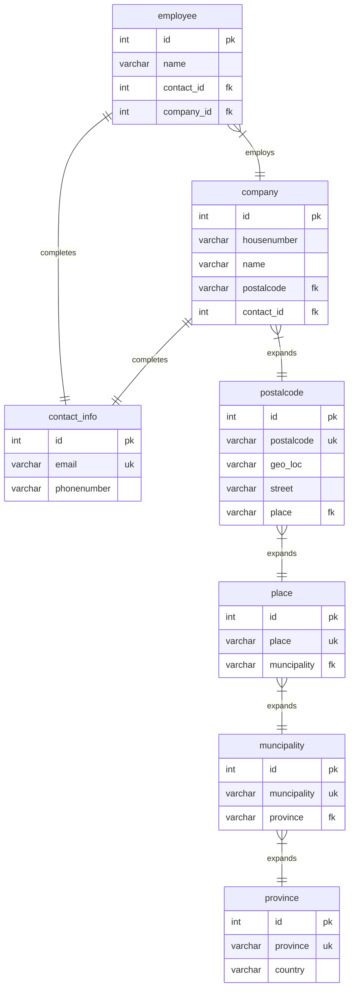

```mermaid
erDiagram
  company ||--|| contact_info : completes
  company }|--|| postalcode : expands
  company{
  int id pk
  varchar housenumber
  varchar name
  varchar postalcode fk
  int contact_id fk
}

  
  postalcode }|--|| place : expands
  postalcode{
  int id pk
  varchar postalcode uk
  varchar geo_loc
  varchar street
  varchar place fk
}

  place }|--|| muncipality : expands
  place{
  int id pk
  varchar place uk
  varchar muncipality fk
}

  muncipality }|--|| province : expands
  muncipality{
  int id pk
  varchar muncipality uk
  varchar province fk
}
  
  province{
  int id pk
  varchar province uk
  varchar country
}
  employee }|--|| company : employs
  employee ||--|| contact_info : completes
  employee{
  int id pk
  varchar name
  int contact_id fk
  int company_id fk
}

  contact_info{
  int  id  pk
  varchar  email uk
  varchar phonenumber
}


```
