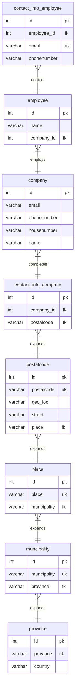

```mermaid
erDiagram
  company }|--|| contact_info_company : completes
  company{
  int id pk
  varchar  email
  varchar phonenumber
  varchar housenumber
  varchar name
}

  contact_info_company }|--|| postalcode : expands
  contact_info_company{
  int  id  pk
  int company_id fk
  varchar postalcode fk
}

  postalcode }|--|| place : expands
  postalcode{
  int id pk
  varchar postalcode uk
  varchar geo_loc
  varchar street
  varchar place fk
}

  place }|--|| muncipality : expands
  place{
  int id pk
  varchar place uk
  varchar muncipality fk
}

  muncipality }|--|| province : expands
  muncipality{
  int id pk
  varchar muncipality uk
  varchar province fk
}
  
  province{
  int id pk
  varchar province uk
  varchar country
}
  employee }|--|| company : employs
  employee{
  int id pk
  varchar name
  int company_id fk
}

  %% I don't know how to include the email and phonenumber in a single table without constructing a circular conneciton
  contact_info_employee }|--|| employee : contact
  contact_info_employee{
  int  id  pk
  int employee_id fk
  varchar  email uk
  varchar phonenumber
}


```
