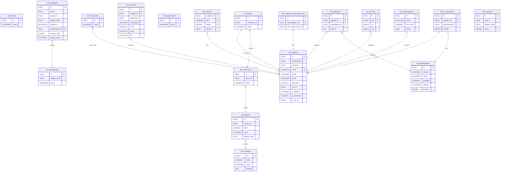

```mermaid
erDiagram

  mhl_brands{
  int(11) id pk
  varchar(50) name
}

  mhl_detaildefs }|--|| mhl_detailgroups : grouped
  mhl_detaildefs{
  int(11) id pk
  int(11) vlevel
  int(11) group_ID
  int(11) display_order
  varchar(100) properties
  int(11) propertytype_ID fk
  char(25) property_DEF
  varchar(50) display_name
}

  mhl_detailgroups{
  int(11) id pk
  int(11) display_order
  varchar(25) name
}
  mhl_cities ||--|{ mhl_suppliers : location
  mhl_cities }|--|| mhl_communes : location
  mhl_cities{
  int(11) id pk
  int(11) commune_id
  varchar(100) name
}

  mhl_communes }|--|| mhl_districts : location
  mhl_communes{
  int(11) id pk
  int(11) distict_id
  varchar(40) name
}


  mhl_districts }|--|| mhl_countries : location
  mhl_districts{
  int(11) id pk
  int(11) country_id
  varchar(4) code
  varchar(20) name
  int(11) display_order
}

  mhl_companies o|--|{ mhl_suppliers : werkt_voor
  mhl_companies{
  int(11) id pk
  varchar(50) name
}

  mhl_departments{
  int(11) id pk
  varchar(50) name
}

  mhl_countries{
  int(11) id pk
  varchar(2) code
  varchar(80) name
  set() display
}

  mhl_contacts }|--|| mhl_suppliers : employs
  mhl_contacts{
  int(11) id pk
  int(11) supplier_ID fk
  int(11) department
  varchar(75)  contacttype
  varchar(75)  name
  varchar(75)  email
  varchar(75)  tel
}


  mhl_hitcount }|--|| mhl_suppliers : test
  mhl_hitcount{
  int(11) supplier_ID pk
  smallint(6) year pk
  tinyint(4) month pk
  int(11) hitcount
}

  mhl_properties }|--|| mhl_suppliers : belongs
  mhl_properties }|--|| mhl_propertytypes : explains
  mhl_properties{
  int(11) id pk
  int(11)  supplier_ID fk
  int(11)  propertytype_ID fk
  text  content
}

  mhl_propertytypes{
  int(11) id pk
  smallint(6) csvreg
  varchar(50)  name
  set(ABCD)  proptype
  varchar(50)  display
  set(YN)  is_filter
}

  mhl_suppliers{
  int(11) id pk
  int(11) membertype
  int(11)  company
  varchar(75)  name uk
  varchar(50)  straat 
  varchar(25) huisnr 
  varchar(7)  postcode
  int(11) city_ID
  varchar(30) p_address
  varchar(7) p_postcode
  int(11) p_city_ID
}

  mhl_suppliers_mhl_rubiek_view ||--|| mhl_suppliers : test
  mhl_suppliers_mhl_rubiek_view{
  int(11) id pk
  int(11)  mhl_suppliers_ID fk
  int(11)  mhl_rubriek_view_ID
}

  mhl_yn_properties ||--|| mhl_suppliers : test
  mhl_yn_properties ||--|| mhl_propertytypes : test
  mhl_yn_properties{
  int(11) id pk
  int(11)  supplier_ID fk
  int(11)  propertytype_ID fk
  set(YN)   content
}

  pc_lat_long ||--|| mhl_suppliers : postcode
  pc_lat_long{
  int(11) id pk
  char(6) pc6 fk
  decimal lat
  decimal lng
}

  mhl_membertypes ||--|| mhl_suppliers : member
  mhl_membertypes{
  int(11) id pk
  varchar(20) name
  smallint(6) sort_order
  int(11) ulevel
}

  mhl_rubieken{
  int(11) id pk
  int(11)  parent
  int(11)  display_order
  char(50) name
}

```
