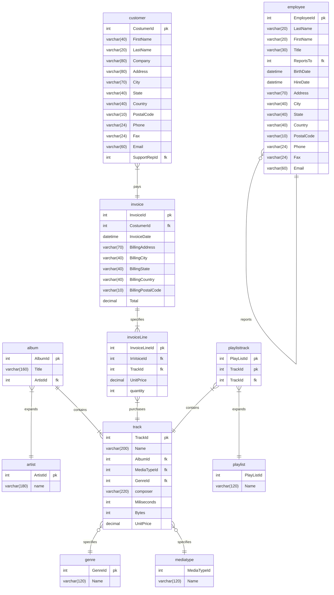

```mermaid
erDiagram
  album }|--|| artist : expands
  album ||--|{ track : contains
  album{
  int AlbumId pk
  varchar(160)  Title
  int ArtistId fk
}


  playlist{
  int PlayListId
  varchar(120) Name
}

  artist{
  int ArtistId pk
  varchar(180) name
}


  genre{
  int GenreId pk
  varchar(120) Name
}

  invoice ||--|{ invoiceLine : specifies
  invoice{
  int InvoiceId pk
  int CostumerId fk
  datetime InvoiceDate
  varchar(70)  BillingAddress
  varchar(40)  BillingCity
  varchar(40)  BillingState
  varchar(40)  BillingCountry
  varchar(10)  BillingPostalCode
  decimal  Total
}

  invoiceLine }|--|| track : purchases
  invoiceLine{
  int InvoiceLineId pk
  int InVoiceId fk
  int TrackId fk
  decimal UnitPrice
  int quantity
}

  mediatype{
  int MediaTypeId
  varchar(120) Name
  }


%% Don't have any other way to represent both trackId keys %%
  playlisttrack }|--|| playlist : expands
  playlisttrack }|--|| track : contains
  playlisttrack{
  int PlayListId pk
  int TrackId pk
  int TrackId fk
}


  track }o--|| genre : specifies
  track }o--||mediatype : specifies
  track{
  int TrackId pk
  varchar(200) Name
  int AlbumId fk
  int MediaTypeId fk
  int GenreId fk
  varchar(220) composer
  int Miliseconds
  int Bytes
  decimal UnitPrice
}


  %%customer ||--{| SupportRep : specifies
  customer }|--|| invoice : pays
  customer{
  int CostumerId pk
  varchar(40)  FirstName
  varchar(20)  LastName
  varchar(80)   Company
  varchar(80)  Address
  varchar(70)  City
  varchar(40)  State
  varchar(40)  Country
  varchar(10)  PostalCode
  varchar(24)  Phone
  varchar(24)  Fax
  varchar(60)  Email
  int SupportRepId fk
}

  employee }O--|| employee : reports
  employee{
  int EmployeeId pk
  varchar(20) LastName
  varchar(20) FirstName
  varchar(30) Title
  int ReportsTo fk
  datetime BirthDate
  datetime HireDate
  varchar(70) Address
  varchar(40)  City
  varchar(40)  State
  varchar(40)  Country
  varchar(10)  PostalCode
  varchar(24)  Phone
  varchar(24)  Fax
  varchar(60)  Email
}

```
